<!-- ══════════════════════ HEADER ══════════════════════ -->
<div align="center">
  
</div>

<!-- ══════════════════════ TYPING ANIMATION ══════════════════════ -->
<div align="center">
  <a href="https://github.com/awais-iqbal-pk">
    
  </a>
</div>

<br/>

<!-- ══════════════════════ PROFILE IMAGE ══════════════════════ -->
<div align="center">
  
</div>

<br/>

<!-- ══════════════════════ SOCIAL BADGES ══════════════════════ -->
<div align="center">
  <a href="https://linkedin.com/in/awaisiqbal786">
    
  </a>
  <a href="https://github.com/awais-iqbal-pk/-SehatAIV2">
    
  </a>
  <a href="mailto:awais.iqbal.developer@gmail.com">
    
  </a>
  
</div>


<!-- ══════════════════════ ABOUT ME ══════════════════════ -->
##  About Me

```python
class AwaisIqbal:
    def __init__(self):
        self.location   = "Lahore, Pakistan 🇵🇰"
        self.education  = "BS Computer Science @ UET Lahore (2023–2027)"
        self.role       = "AI/ML Engineer · Python Developer · Full-Stack Builder"
        self.focus      = "Shipping production-grade AI systems, solo, end to end"

        self.stack = {
            "frontend":  ["React", "React Native", "Next.js (learning)"],
            "backend":   ["Node.js", "Express.js", "FastAPI"],
            "databases": ["PostgreSQL", "MongoDB", "Redis", "Firebase"],
            "ai_ml":     ["OpenAI API", "Gemini API", "OpenCV", "Pydantic"],
            "devops":    ["Docker", "Docker Compose", "Git", "pytest"],
        }

        self.shipped = "AI healthcare platform, real-time object detection system, " \
                        "and a growing library of production-grade tools"

    def currently_learning(self):
        return ["TypeScript", "Next.js App Router", "System Design", "MLOps"]

awais = AwaisIqbal()
```

- 🩺 Building **Sehat AI** — an AI-powered healthcare platform for Pakistan, solo-architected from database to deployment
- 👁️ Built a **real-time webcam object detection system** using computer vision — live inference, not a notebook demo
- 🤖 Deep hands-on experience integrating **OpenAI & Gemini APIs** into real, structured, production workflows
- 📫 Reach me on [LinkedIn](https://linkedin.com/in/awaisiqbal786) or [email](mailto:awais.iqbal.developer@gmail.com)


<!-- ══════════════════════ TECH STACK ══════════════════════ -->
##  Tech Stack

<div align="center">

### Frontend & Mobile


### Backend, APIs & Databases


### AI/ML, Computer Vision & Tools


</div>


<!-- ══════════════════════ GITHUB ANALYTICS ══════════════════════ -->
##  GitHub Analytics

<div align="center">
  
  
</div>

<div align="center">
  
</div>

<br/>

<div align="center">
  
</div>

<br/>

##  GitHub Trophies

<div align="center">
  
</div>


<!-- ══════════════════════ SIGNATURE PROJECTS ══════════════════════ -->
##  Signature Projects

| Project | What it does | Tech |
|---|---|---|
| 🩺 **Sehat AI** | Cross-platform **AI health assistant** for Pakistan — symptom analysis, AI-generated health summaries, doctor discovery, and appointment scheduling, with JWT auth and encrypted patient data | React Native, FastAPI, MongoDB, Gemini API |
| 👁️ **Webcam Object Detection** | **Real-time computer vision system** — live object detection and classification through webcam feed, low-latency inference pipeline | Python, OpenCV |

> 💡 More projects are actively being pushed — this list is growing every week.

### 📂 Explore the Code

<div align="center">
  <a href="https://github.com/awais-iqbal-pk/-SehatAIV2">
    
  </a>
  <a href="https://github.com/awais-iqbal-pk/webcam-object-detection">
    
  </a>
</div>


<!-- ══════════════════════ CONTRIBUTION SNAKE ══════════════════════ -->
##  Contribution Snake

<div align="center">
  
</div>


<!-- ══════════════════════ LET'S CONNECT ══════════════════════ -->
##  Let's Build Something Together

<div align="center">

**🚀 Actively seeking AI/ML, Full-Stack & Python opportunities** — internships, remote contracts, and collaborations

<br/>

<a href="https://linkedin.com/in/awaisiqbal786">
  
</a>
<a href="mailto:awais.iqbal.developer@gmail.com">
  
</a>
<a href="https://github.com/awais-iqbal-pk?tab=followers">
  
</a>

<br/><br/>

<sub>⚡ <i>"Ship it, measure it, then make it better."</i></sub>

</div>

<!-- ══════════════════════ FOOTER ══════════════════════ -->
<div align="center">
  
</div>
